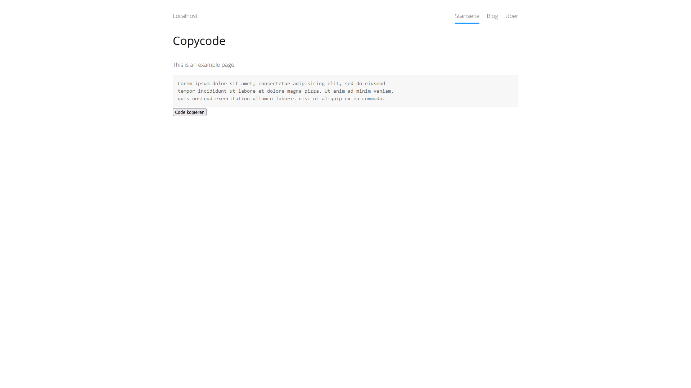

<p align="right"><a href="README-de.md">Deutsch</a> &nbsp; <a href="README.md">English</a></p>

# Copycode 0.9.0

Copy code blocks to clipboard.

<p align="center"></p>

## How to install an extension

[Download ZIP file](https://github.com/schulle4u/yellow-copycode/archive/refs/heads/main.zip) and copy it into your `system/extensions` folder. [Learn more about extensions](https://github.com/annaesvensson/yellow-update).

## How to copy a code block

Write a fenced or indented code block and create a `[copycode]` shortcut.

## Examples

Content file with code block and copy button:

    ---
    Title: Example
    ----
    This is an example page. 
    
    ```
    Lorem ipsum dolor sit amet, consectetur adipisicing elit, sed do eiusmod 
    tempor incididunt ut labore et dolore magna pizza. Ut enim ad minim veniam, 
    quis nostrud exercitation ullamco laboris nisi ut aliquip ex ea commodo. 
    ```

    [copycode]

## Developer

Steffen Schultz. [Get help](https://datenstrom.se/yellow/help/).
