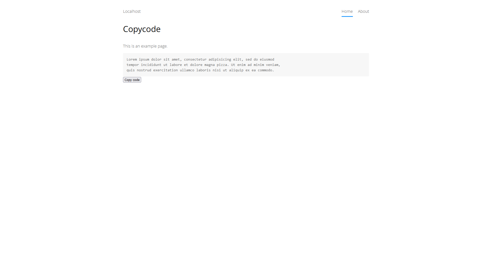

# Copycode 0.9.1

Code-Blöcke in Zwischenablage kopieren. Entwickelt von Steffen Schultz.

## Wie man eine Erweiterung installiert

[ZIP-Datei herunterladen](https://github.com/schulle4u/yellow-copycode/archive/refs/heads/main.zip) und in dein `system/extensions`-Verzeichnis kopieren. [Weitere Informationen zu Erweiterungen](https://github.com/annaesvensson/yellow-update/tree/main/README-de.md).

## Wie man einen Code-Block kopiert

Diese Erweiterung platziert eine Code-Kopieren-Schaltfläche unter jeden umrahmten oder eingerückten Code-Block in einer Seite. Klicke auf den Button, um den Inhalt des Code-Blocks in die Zwischenablage zu kopieren. 

Hast du Fragen? [Hilfe finden](https://datenstrom.se/de/yellow/help/).
